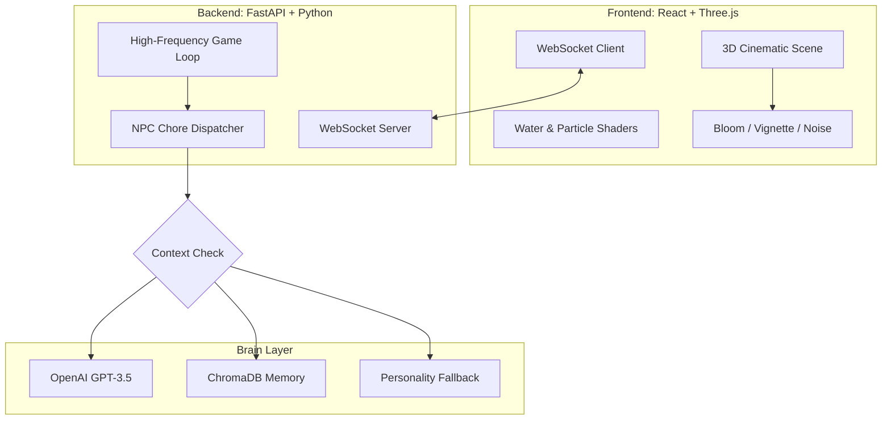

# 🌲 AI Village: A Cinematic Autonomous Ecosystem

[](https://fastapi.tiangolo.com/)
[](https://reactjs.org/)
[](https://threejs.org/)
[](https://openai.com/)

> **"A living, breathing 3D world where AI agents don't just exist—they live."**  
> AI Village is a production-grade, real-time 3D simulation of autonomous agents inhabiting a persistent procedural ecosystem. Experience a world of deep memory, social dynamics, and cinematic atmosphere.

---

## 🎭 The Living World

Welcome to a village that never sleeps. Our 6 unique citizens perform daily routines, share whispered secrets, and remember every interaction. 

*   **Elias the Clockmaker** winds the village gears.
*   **Bramble the Fisherman** patrols the animated river.
*   **Clara the Baker** fills the air with the scent of fresh bread (and chimney smoke).

---

## ✨ Cutting-Edge Features

### 🎬 Cinematic Graphics Pipeline
*   **Post-Processing Suite:** High-end **Bloom**, **Vignette**, and **Film Grain** effects for a professional animated aesthetic.
*   **Procedural FX:** Real-time **Chimney Smoke particles** and a **dynamic water shader** with reflected highlights.
*   **Glass-Morphism HUD:** A modern, high-fidelity UI that tracks village statistics and simulation status in real-time.

### 🧠 Autonomous Chore Engine
*   **Purposeful Routines:** NPCs possess logic-driven schedules. They travel to specific "Hotspots" (River, Bakery, Hills) to perform chores based on their unique identities.
*   **Proximity-Based Socializing:** Agents automatically detect neighbors, stop their routines, and engage in context-aware conversations powered by **OpenAI**.
*   **Zero-Latency Fallbacks:** A custom **Local Personality Engine** ensures the village remains alive and chatty even when external AI quotas are reached.

### 📜 Deep RAG Memory (Vectorized Souls)
*   **ChromaDB Integration:** Every word spoken is vectorized and stored in a long-term memory bank.
*   **Semantic Recall:** NPCs recall relevant past "gossip" and previous encounters to shape their current mood and responses.

---

## 🛠️ System Architecture



---

## ⚡ Setup & Deployment

### 1. Requirements
*   Python 3.10+
*   Node.js 18+

### 2. Launch Backend
```bash
cd backend
pip install -r requirements.txt
# Create .env with OPENAI_API_KEY for full AI features
uvicorn main:app --host 0.0.0.0 --port 8000
```

### 3. Launch Frontend
```bash
cd frontend
npm install
npm run dev
```

Visit **[http://localhost:5173/](http://localhost:5173/)** to step into the village.

---

## 🗺️ Village Cast & Activities

| Citizen | Role | Daily Routine | Personality |
| :--- | :--- | :--- | :--- |
| **Elias** | 🕰️ Clockmaker | Winding the Great Clock | Metaphorical, Reclusive |
| **Bramble** | 🎣 Fisherman | Patrolling the Riverbanks | Grumpy, Observant |
| **Thistle** | 🌿 Herbalist | Searching the East Hills | Energetic, Curious |
| **Clara** | 🍞 Baker | Working at the Village Bakery | Warm, Welcoming |
| **Sera** | ✍️ Poet | Stargazing on the West Hill | Quiet, Intense |
| **Silas** | 🌌 Traveler | Wandering the Valley | Mysterious, Wise |

---

## 🛤️ Project Roadmap

- [x] **Cinematic FX:** Bloom, Vignette, and Particle Systems.
- [x] **Chore System:** Logic-driven NPC daily routines.
- [ ] **Dynamic Weather:** Rain and fog affecting NPC pathfinding.
- [ ] **Economic Layer:** NPCs "trading" items found during chores.

---

*Designed with ❤️ for a fully autonomous future.*
