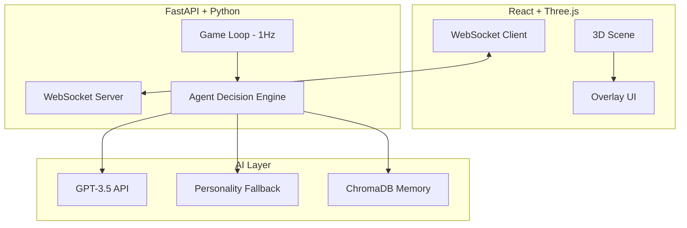

# 🌲 AI Village: The Autonomous 3D Ecosystem


[](https://fastapi.tiangolo.com/)
[](https://reactjs.org/)
[](https://threejs.org/)
[](https://openai.com/)
[](https://opensource.org/licenses/MIT)

> **"In the silence of the gears, the village finds its soul."**  
> An advanced, production-grade 3D simulation of autonomous AI agents living in a persistent, procedural ecosystem.

---

## 🎭 The Village Lore

Nestled between rolling hills and a winding river lies a town unlike any other. Its inhabitants don't just follow scripts; they **think, remember, and socialize**. Every character carries the weight of their past interactions, whispered secrets, and personal ambitions.

*   **The Clockmaker** watches the rust of time.
*   **The Herbalist** hunts for secrets in the moss.
*   **The Traveler** gazes at constellations that only he understands.

---

## 🚀 Advanced Features

### 🧠 The "Global Brain" Architecture (Real-Time WebSockets)
Unlike traditional simulations that use static polling, **AI Village** is powered by a high-frequency WebSocket backbone.
*   **Autonomous Server-Side Loop:** The backend ticks every second, processing pathfinding, proximity checks, and state transitions.
*   **State Synchronization:** Every millisecond coordinate shift is broadcast to all clients, ensuring a perfectly mirrored world for every observer.

### 📜 Persistent RAG-Based Memory
Every NPC is equipped with a **Retrieval-Augmented Generation (RAG)** system powered by **ChromaDB**.
*   **Long-Term Memory:** Interactions aren't forgotten. They are vectorized and stored.
*   **Semantic Retrieval:** When you or another NPC speaks to a character, they "recall" relevant past experiences to shape their response.
*   **Memory Growth:** The more the village lives, the deeper and more complex its social fabric becomes.

### 🏘️ Hybrid Procedural 3D Engine
Designed for **zero-friction loading** and extreme stability.
*   **Infinite Landscapes:** Procedural hills, rivers, and forests built with raw Three.js math.
*   **Animated Entities:** Stylized characters with custom "bob-and-lerp" animation logic for organic movement.
*   **Dynamic Lighting:** Real-time shadow casting and glowing emissive windows that bring the village to life at "night."

### 🛡️ Resilient Intelligence Engine
*   **Smart Fallbacks:** Integrated a **Local Personality Engine** that maintains character immersion even if OpenAI quotas are exceeded. The village never goes "braindead."

---

## 🛠️ Technical Breakdown



---

## ⚡ Quick Start

### 1. Requirements
*   Python 3.10+
*   Node.js 18+

### 2. Clone & Install
```bash
git clone https://github.com/nikhilJaiswal7/Ai-town-simulation.git
cd Ai-town-simulation
```

### 3. Launch the Soul (Backend)
```bash
cd backend
pip install -r requirements.txt
# Add OPENAI_API_KEY to .env for full intelligence
uvicorn main:app --host 0.0.0.0 --port 8000
```

### 4. Open the Window (Frontend)
```bash
cd ../frontend
npm install
npm run dev
```

---

## 🗺️ Character Roster

| Villager | Archetype | Soul/Personality |
| :--- | :--- | :--- |
| **Elias** | 🕰️ Clockmaker | Reclusive, speaks in metaphors about time and decay. |
| **Sera** | ✍️ Poet | Quiet, intense presence, lost her voice but not her mind. |
| **Thistle** | 🌿 Herbalist | Energetic, searching for rare moss near the river. |
| **Bramble** | 🎣 Fisherman | Grumpy but observant, watches the river's secrets. |
| **Clara** | 🍞 Baker | Warm, laughter like fresh bread, the village's heart. |
| **Silas** | 🌌 Traveler | Mysterious, gazes at the stars from the high hills. |

---

## 🛤️ Future Roadmap

- [ ] **Dynamic Weather:** Rain and fog affecting NPC moods.
- [ ] **Player Influence:** The ability to "drop" items that NPCs can find and discuss.
- [ ] **Village Council:** Scheduled meetings where all NPCs gather to debate the village's future.
- [ ] **Visual Upgrades:** Real-time day/night cycles with shifting shadows.

---

## 🤝 Contributing

Contributions are what make the open-source community such an amazing place to learn, inspire, and create. Any contributions you make are **greatly appreciated**.

1. Fork the Project
2. Create your Feature Branch (`git checkout -b feature/AmazingFeature`)
3. Commit your Changes (`git commit -m 'Add some AmazingFeature'`)
4. Push to the Branch (`git push origin feature/AmazingFeature`)
5. Open a Pull Request

---

*Designed with ❤️ for a fully autonomous future.*
